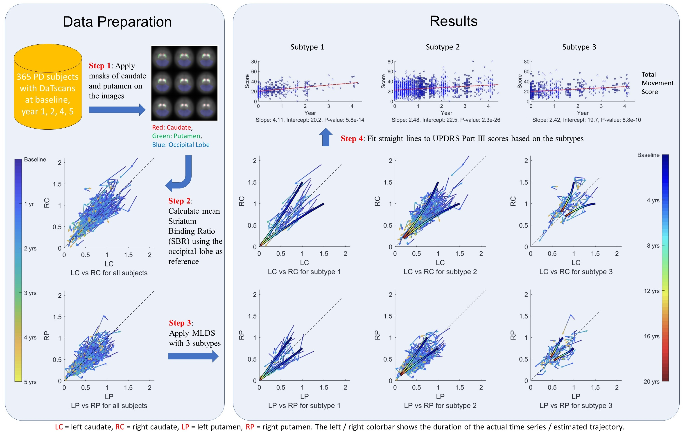

# Neurodegenerative Disease Progression Model for Parkinson's Disease Analysis
Yuan Zhou

## Introduction

Parkinson's disease (PD) progression can be studied using DaTscans collected from living PD subjects, which reflect the density of dopamine transporters in the striatum of the brain, hence measure the availability of dopaminergic neurons left in the PD subjects.

The PPMI dataset provides 449 subjects that have DaTscans collected at baseline, year 1, 2, 4, and 5. Preprocessing the dataset leaves us with 365 subjects whose *striatal binding ratios* (SBR) are calculated for 4 regions: left caudate (LC), left putamen (LP), right putamen (RP), right caudate (RC). By applying a *mixture of linear dynamical systems* (MLDS) to this longitudinal dataset, we find 3 subtypes that correspond to different progression speeds.



This repository contains the Matlab implementation of this MLDS algorithm. 

If you find some of the code helpful, please cite the corresponding papers.  

Zhou, Y., Tagare, H. D., "Bayesian Longitudinal Modeling of Early Stage Parkinson’s Disease Using DaTscan Images", *International Conference on Information Processing in Medical Imaging*, Hongkong, 2019  
(https://link.springer.com/chapter/10.1007/978-3-030-20351-1_31)  

Zhou, Y., Tinaz, S., Tagare, H. D., "Robust Bayesian Analysis of Early-Stage Parkinson's Disease Progression Using DaTscan Images". *IEEE Transactions on Medical Imaging*, 2020  
(https://ieeexplore.ieee.org/document/9225726)  

#### Organization

The folder "mlds" contains the algorithm implementation of MLDS.  

The folder "utils" contains some utility functions.  

## Mixture of Linear Dynamical Systems

The MLDS models the exponential decay of signals in the DaTscans using a linear dynamical system (LDS) with *t*-distributed noise residues and a centrosymmetric transition matrix. Extending this LDS to K distinct transition matrices and noise variances, we can capture the subtypes inherent in the dataset.
  


To see the demo, change the directory to "mlds" in Matlab and run
```
run_algo;
```


#### Organization

The "EM" folder contains the EM algorithm to solve the MLDS.

The "gibbs_sampling" folder contains the Gibbs sampling algorithm to solve the MLDS.

The "model_selection" folder contains the model selection (Bayesian or cross validation) code for both the Gaussian noise case and the *t*-distribution noise case.

The "utility" folder contains the utility code used for the MLDS.

The "data" folder contains the processed DaTscan data.


## Contact

If you have any questions, please contact:

Yuan Zhou  
Department of Radiology and Biomedical Imaging  
Yale School of Medicine  

zhouyuanzxcv@gmail.com

